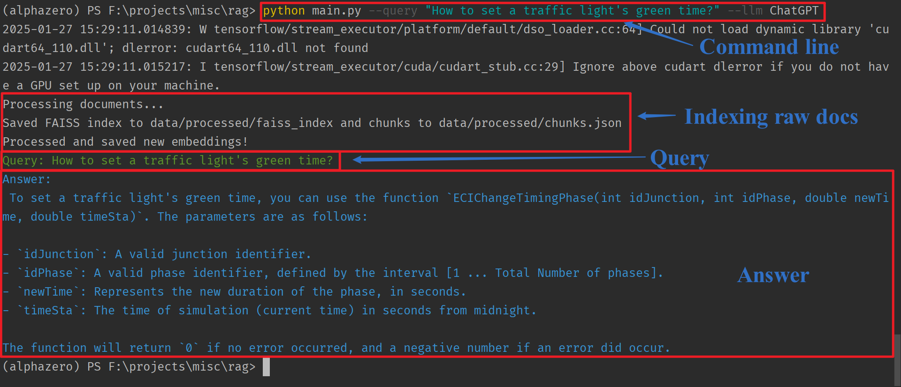

# Introduction
This repository contains the code for the QA system based on RAG and Reranking for the on-premise deployment of a QA system for the user manual of a traffic simulator named Aimsun. 

# News
- 2025-01-27: Support Reranking.
- 2025-01-26: Support tracing changes on raw documents. Re-indexing will be performed on all documents if changes happen.
- 2025-01-25: Proof of Concept (PoC) for the on-premise deployment of a QA system based on RAG on a minimal text data.


# Installation

## Step 1: Clone the repository
```bash
git clone https://github.com/HsiaoTsan/RAG-Rerank.git
cd RAG-Rerank
```

## Step 2: Create a virtual environment & Install the dependencies
```bash
python3 -m venv rag-rerank-project

## Install the dependencies
pip install -r requirements.txt
```

## Step 3: Setup your API Key
You need to set up your API key for the ChatGPT/DeepSeek model. You can get the API key from the OpenAI/DeepSeek website. Note that Both ChatGPT and DeepSeek use OpenAI key interface. 

Ubuntu:
```bash
export OPENAI_API_KEY=your_chatgpt_or_deepseek_api_key
```

Windows:
```bash
set OPENAI_API_KEY=your_chatgpt_or_deepseek_api_key
```

You're all set!


# Usage
LLM backbone can be either ChatGPT or DeepSeek:

Example usage:

```python main.py --query "How to set a traffic light's green time?" --llm ChatGPT```

```python main.py --query "How to set a traffic light's green time?" --llm DeepSeek```

You will see the output as the following screenshot:





# Code Architecture
```
├── config/               # Configuration files
│   ├── llm_config.py     # Configuration files for LLM
├── data/                 # Raw and processed data
│   ├── raw_documents/    # PDFs, text files, etc.
│   └── processed/        # Chunks, embeddings, etc.
├── src/
│   ├── ingestion/        # Data preprocessing and embedding
│   │   ├── chunking.py   # Document chunking tools 
│   │   ├── db_handler.py # Vector DB operations
|   |   ├── doc_loader.py # Document loader
|   |   ├── document_manager.py  # Trace whether raw documents are changed 
│   │   └── embedding.py  # Embedding tool, e.g., ChatGPT embedder or HuggingFace, etc.
│   ├── retrieval/        # Vector search logic
|   |   ├── reranker.py   # Reranker
|   |   └── retriever.py  # Search document chunks similar to the query
│   ├── generation/       # LLM integration
|   |   └── generator.py  # Generate answers based on the query and the relevant chunks. LLMs can be either ChatGPT or DeepSeek
│   ├── evaluation/       # Metrics and testing
│   └── api/              # REST/gRPC endpoints
└── main.py               # Entry point for the pipeline
```